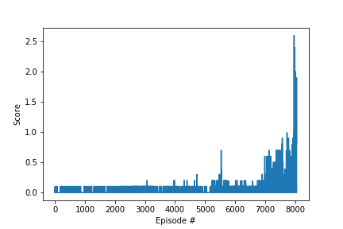

# drln_tennis
UDACITY DRLN Project 3: Tennis Environment


## Learning Algorithm
A multi-agent DDPG (Deep Deterministic Policy Gradient) agent is trained (MaDDPG.py) with shared experience replay memory of size 1e+5, where experience tuples of ("state", "action", "reward", "next_state", "done") are added. 

A local and target network is initialized for the actor and critic separately for eacg agent.  The critic Q(s, a) is learned using the Bellman equation as in Q-learning and MSE. The actor is updated by following the applying the chain rule to the expected return from the start distribution J with respect to the actor parameters:<br />
<br />
Source: [CONTINUOUS CONTROL WITH DEEP REINFORCEMENT LEARNING, 2016](https://arxiv.org/pdf/1509.02971.pdf)


For the exploration noise process temporally correlated noise was used in order to explore well in the environment that has momentum. Ornstein-Uhlenbeck process (Uhlenbeck & Ornstein, 1930) is used with θ = 0.15 and σ = 0.2. The Ornstein-Uhlenbeck process models the velocity of a Brownian particle with friction, which results in temporally correlated values centered around 0. The noise process is added to the actor policy.

A warm-up of 500 steps (random actions) is being used before actually using the actor network to choose the actions.

During sampling, the agent chooses an action from current state, observes reward and the next state. This experience is stored in memory (class ReplayBuffer). The action is selected based on the evaluation of the actor network.

The action values are clipped between -1 and 1.

During training, random minibatch of 512 experience tuples are sampled from replay memory (uniformly). 

The algorithm of DDPG is the following:<br />
<br />
Source: [CONTINUOUS CONTROL WITH DEEP REINFORCEMENT LEARNING, 2016](https://arxiv.org/pdf/1509.02971.pdf)

Soft update is performed to the model parameters from local to target networks of the critic and actor: <br />
θ_target = τ*θ_local + (1 - τ)*θ_target. <br />

For the multi-agent DDPG, the DDPG algorithm was modified to initialize two agents simultaneously with separate local and target networks. They share the experience replay memory.

Hyperparameters used:
- BUFFER_SIZE = int(1e5)  # replay buffer size
- BATCH_SIZE = 512        # minibatch size
- GAMMA = 0.99            # discount factor
- TAU = 1e-3              # for soft update of target parameters
- LR_ACTOR = 1e-4         # learning rate of the actor 
- LR_CRITIC = 1e-3        # learning rate of the critic
- WEIGHT_DECAY = 0        # L2 weight decay
- UPDATE_EVERY = 10        # how often to update the network

The actor network consists of 2 linear layers with relu activation function and batch normalization layers in between followed by a final linear layer with tanh and output the number of possible actions. Input size is 1D array of size equal to state_size, here 33. The neural network has the following architecture on pytorch:<br />
```python
Actor(
  (fc1): Linear(in_features=33, out_features=256, bias=True)
  (bn1): BatchNorm1d(256, eps=1e-05, momentum=0.1, affine=True, track_running_stats=True)
  (fc2): Linear(in_features=256, out_features=256, bias=True)
  (bn2): BatchNorm1d(256, eps=1e-05, momentum=0.1, affine=True, track_running_stats=True)
  (fc3): Linear(in_features=256, out_features=4, bias=True)
)
```

The critic network consists of 2 linear layers with relu activation function and batch normalization layers in between followed by a final linear layer and output the Q value. Input size is 1D array of size equal to state_size, here 33. The neural network has the following architecture on pytorch:<<br />
```python
Critic(
  (fcs1): Linear(in_features=33, out_features=128, bias=True)
  (bn1): BatchNorm1d(128, eps=1e-05, momentum=0.1, affine=True, track_running_stats=True)
  (fc2): Linear(in_features=132, out_features=256, bias=True)
  (bn2): BatchNorm1d(256, eps=1e-05, momentum=0.1, affine=True, track_running_stats=True)
  (fc3): Linear(in_features=256, out_features=1, bias=True)
)
```

## Plot of Rewards
Average reward of approximately 0.8 over 100 epochs is achieved at approximately 7950 episodes.

.

## Ideas for Future Work

- Experimenting with deeper and different architectures along with pre-trained weights. However, 1D convolutional network does not seem offer better performance. Exhaustive search of the optimal number of layers and neurons and different activation functions could lead to performance improvement. Fine-tuning the learning rate or applying a decaying rate could also improve training.
- Prioritized replay (selecting important experiences more frequently than others based on probabilities) should help learn the environment more efficiently. (https://arxiv.org/abs/1511.05952)
- Normalizing states and rewards could also improve learning.
- Another interesting algorithm that could be used here is the A0C (https://liacs.leidenuniv.nl/~plaata1/papers/pal2018.pdf), that extends Alpha Zero to continuous action space.
- It would also worth investigating whether sharing the same actor or/and critic network among the agents could accelerate and improve learning.